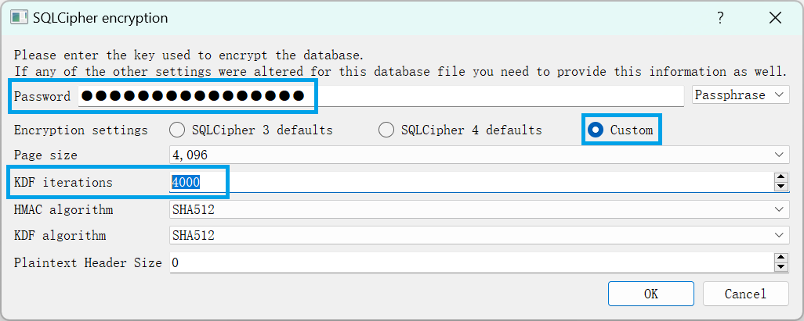
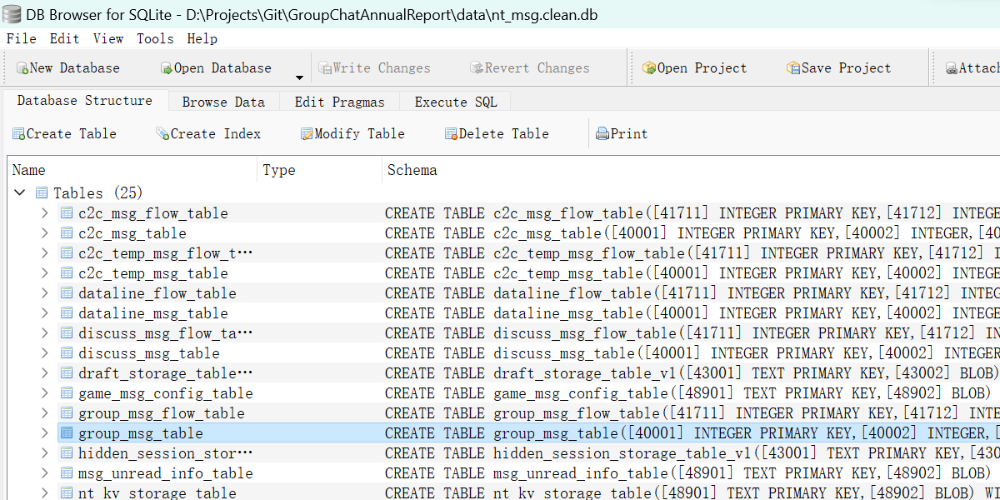
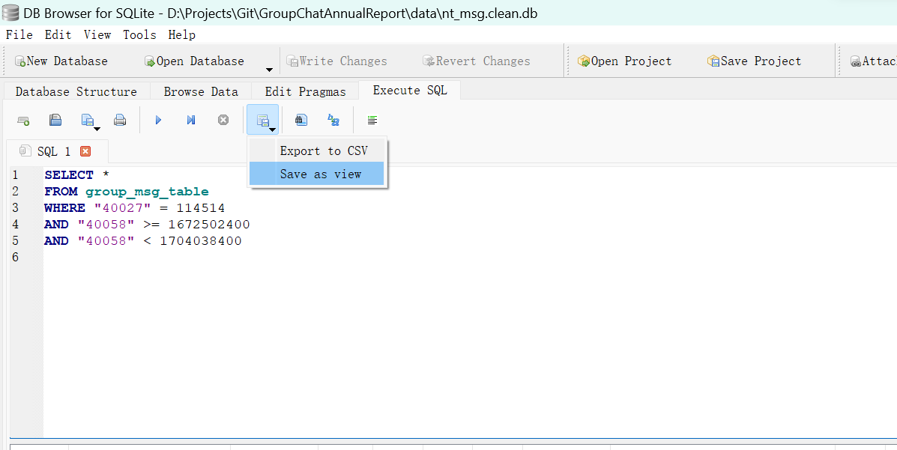
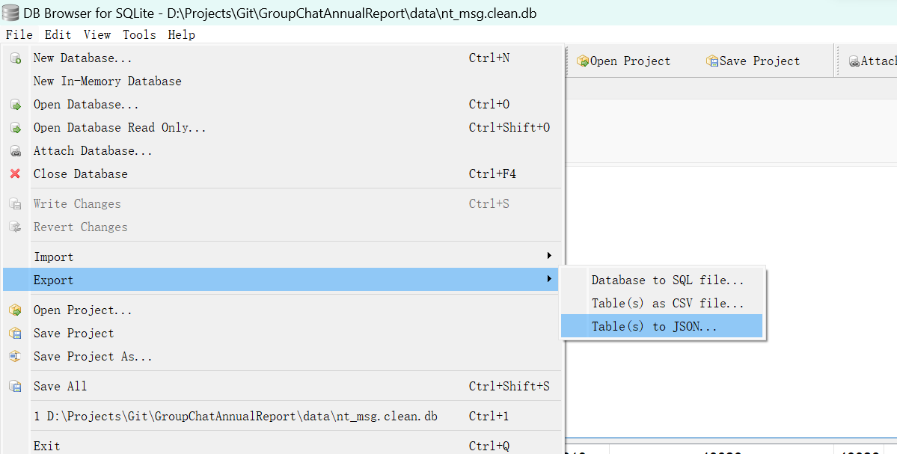
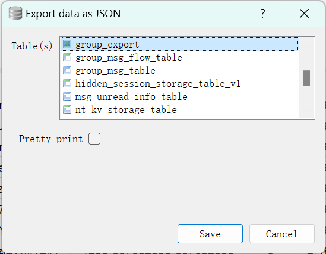

<!-- markdownlint-disable MD026 MD029 MD033 MD041 MD045 -->

# QQ 群聊年度报告！

使用 QQNT Windows 客户端导出群聊聊天记录并制作年度报告。

## 准备工作

1. QQNT Windows 客户端

请在官方网站下载 QQNT Windows 客户端。

本文所述的方法在 9.9.6.20201, 9.9.6-19689, 9.9.6-19189 版本中测试通过。根据参考资料的描述，在 9.9.3-17749, 9.9.3-17412 版本也测试通过。

2. IDA Pro

下载地址：<https://down.52pojie.cn/Tools/Disassemblers/IDA_Pro_v8.3_Portable.zip>，解压后根目录的 `ida64.exe` 为本文需要使用的可执行文件。

3. DB Browser for SQLite

下载地址：<https://download.sqlitebrowser.org/DB.Browser.for.SQLite-3.12.2-win64.zip>，解压后根目录的 `DB Browser for SQLCipher.exe` 为本文需要使用的可执行文件。

4. Python 3

推荐使用 >=3.8 的版本，并添加到 PATH 环境变量中。

## 聊天记录导出

由于聊天记录数据库文件是加密的，需要先获取数据库密码。

### 获取数据库密码

方法来源：<https://github.com/Mythologyli/qq-nt-db>

1. 打开 `ida64.exe`，选择新建项目。

2. 在弹出的资源管理器界面中定位到 QQNT 安装目录下的 `./resources/app/versions/{version}` 文件夹，其中 `{version}` 为 QQNT 的版本号。在右下角过滤器中选择全部文件，单击 `wrapper.node` 文件，并点击右下角的 "Open" 按钮。


3. 保持默认导入选项，点击 "OK" 按钮。如果有弹出 symbol 文件相关提示框点击 "No"。等待文件加载完成。

4. 按快捷键 <kbd>Shift</kbd> + <kbd>F12</kbd> 打开 Strings 标签，等待页面加载完成。切换到 Strings 标签使用鼠标单击内部区域，按快捷键 <kbd>Ctrl</kbd> + <kbd>F</kbd> 打开搜索框，输入 `nt_sqlite3_key_v2`。


5. 双击 `nt_sqlite3_key_v2: db=%p zDb=%s` 一行，跳转到 IDA View-A 标签的对应行。

6. 点击顶部导航栏 "Options" 中的 "General..." 菜单项，打开 IDA Options 窗口。在 Disassembly 标签页中，将 Display assembly lines 中的 Source line numbers 勾选上，点击 "OK" 按钮。


7. 在 IDA View-A 标签中，单击 `nt_sqlite3_key_v2` 的名称 `aNtSqlite3KeyV2`，按快捷键 <kbd>X</kbd> 打开交叉引用窗口。


8. 双击第一条结果，转到引用位置。


9. 按快捷键 <kbd>F5</kbd> 进行反编译，如果有弹出窗口点击 "Yes"。等待反编译完成。


10. 单击引用语句的左侧蓝色圆点添加断点。


11. 修改 Debugger 下拉框的值为 "Local Windows Debugger"。


12. 如果有正在运行的 QQNT 客户端，先全部退出。打开一个新的 QQNT 客户端，进入登录界面并暂停操作。

13. 在 IDA 中点击顶部导航栏 "Debugger" 中的 "Attach to process..." 菜单项，打开 "Attach to process" 窗口。从最后开始找到第一个 `QQ.exe` 进程，双击打开。


14. 等待加载完成后按快捷键 <kbd>F9</kbd> 继续运行。

15. 进行登录操作，触发断点。

16. 在 IDA 中点击顶部导航栏 "Debugger" 中的 "Debugger windows" 菜单项，打开 Locals 选项卡。


17. 右击 Locals 选项卡的 `a3`，点击 "Jump to..." 菜单项。


18. 记录对应地址从 `0` 到 `F` 的 16 个字节对应的字符串，即为数据库密码。


### 数据导出

消息数据库默认位于 `%USERPROFILE%/Documents/Tencent Files/{qq}/nt_qq/nt_db/` 目录下，其中 `{qq}` 为 QQ 号。复制该目录下的 `nt_msg.db` 文件到本项目的 `./data/` 目录下。

1. 在复制过来的 `nt_msg.db` 所在文件夹运行以下命令，分离数据库头部与数据库本体。如果数据库文件较大，可能会花费较长时间。

使用 PowerShell 7：

```powershell
$content = Get-Content -Path nt_msg.db -AsByteStream -Raw
$content_header = $content[0..1024]
$content_body = $content[1024..($content.length-1)]
Set-Content -Path nt_msg.header.txt -Value $content_header -AsByteStream
Set-Content -Path nt_msg.body.db -Value $content_body -AsByteStream
```

如果安装有 WSL，可以在 WSL 中转到对应文件夹运行以下命令：

```bash
cat nt_msg.db | head -c 1024 > nt_msg.header.txt
cat nt_msg.db | tail -c +1025 > nt_msg.body.db
```

2. 使用文本编辑器打开文件 `nt_msg.header.txt`，如果存在文本 `HMAC_` 则记录对应的 HMAC 算法。例如 `HMAC_SHA1` 对应的 HMAC 算法为 `SHA1`，如果没有对应文本则为 `SHA512`。

3. 打开 `DB Browser for SQLCipher.exe`，点击 "File" 菜单中的 "Open Database..." 菜单项，打开 `nt_msg.body.db` 文件。

4. 在弹出的 "SQLCipher encryption" 窗口中的 Password 输入框中输入数据库密码，Encryption settings 选择 "Custom"，修改 KDF iterations 为 `4000`，修改 HMAC algorithm 为第 2 步所获取的 HMAC 算法，点击 "OK" 按钮。



5. 在 Database Structure 标签页中，可以查看数据库中的表。其中 `c2c_msg_table` 表为私聊消息表；`group_msg_table` 表为群聊消息表。



6. 在 Browse Data 标签页中，可以查看表中的数据；在 Execute SQL 标签页中，可以执行 SQL 语句。如果数据量不大，可以直接使用 SQL 语句进行数据分析。数据量较大或需要进行消息内容分析时，需要先进行数据过滤，然后导出。需要过滤单个群聊的 2024 年数据时，在 Execute SQL 标签页中执行（快捷键 <kbd>F5</kbd>）以下 SQL 语句，其中 `{group_id}` 为群号。

```sql
SELECT *
FROM group_msg_table
WHERE "40027" = {group_id}
AND "40058" >= 1704038400
AND "40058" < 1735574400
```

7. 待执行生成后，将结果保存为 view 并命名，如 `group_export`。



8. 在 "File" 菜单中选择 "Export" 菜单项，点击 "Table(s) to JSON..."。



9. 选择刚刚保存的 view，点击 "Save" 按钮，选择路径为本项目的 `./data/` 目录，等待导出完成。



## 数据分析

TODO

## 数据库字段含义

`group_msg_table` 表中的部分列含义如下：

| 列名  | 类型  | 含义         | 说明                                                                              |
| ----- | ----- | ------------ | --------------------------------------------------------------------------------- |
| 40001 | int   | 消息 ID      |                                                                                   |
| 40003 | int   | 消息序号     | 在每个群聊中依次递增                                                              |
| 40020 | str   | UID          | nt_uid, 对应 nt_uid_mapping_table                                                 |
| 40021 | str   | 群号         |                                                                                   |
| 40027 | int   | 群号         |                                                                                   |
| 40030 | int   | 群号         | QQNT 保存的群号                                                                   |
| 40033 | int   | 发送者 QQ 号 | QQNT 保存发送者 QQ 号                                                             |
| 40050 | int   | 时间         | 时间戳                                                                            |
| 40058 | int   | 日期         | 当日 0 时整的时间戳格式，时区为 GMT+0800                                          |
| 40090 | str   | 发送者群名片 | 旧版 QQ 迁移数据中格式为 `name(12345)` 或 `name<i@example.com>`， QQNT 中为群名片 |
| 40093 | str   | 发送者昵称   | 旧版 QQ 此字段为空，QQNT 中未设置群名片时才有此字段                               |
| 40600 | bytes | 撤回状态     | protobuf 格式                                                                     |
| 40800 | bytes | 消息内容     | protobuf 格式                                                                     |
| 40850 | int   | 回复消息序号 | 该消息所回复的消息的序号                                                          |

## Protobuf 消息格式

消息内容 protobuf 的部分字段含义如下：

| Field Number | 类型                       | 含义   | 说明                                         |
| ------------ | -------------------------- | ------ | -------------------------------------------- |
| 48000        | protobuf 或 protobuf array | 消息段 | 一条消息中可以有多个消息段，部分类型中可嵌套 |

消息段（48000）的部分字段含义如下：

| Field Number | 类型     | 含义                                                     | 说明               |
| ------------ | -------- | -------------------------------------------------------- | ------------------ |
| 45001        | int      | 消息段 ID                                                |                    |
| 45002        | int      | 消息类型                                                 | 见下表             |
| 45101        | str      | 消息文本                                                 | 适用于文本消息     |
| 45102        | str      | 图片文件名                                               | 适用于图片消息     |
| 45402        | str      | 图片文件名                                               | 适用于图片消息     |
| 45411        | int      | 图片宽度（压制后）                                       | 适用于图片消息     |
| 45412        | int      | 图片高度（压制后）                                       | 适用于图片消息     |
| 45812        | str      | 本地缓存目录                                             | 适用于图片消息     |
| 45815        | str      | 替代文本，如 "[动画表情]"                                | 适用于图片消息     |
| 47402        | int      | 原消息序号                                               | 适用于引用消息     |
| 47403        | int      | 原消息发送者                                             | 适用于引用消息     |
| 47404        | int      | 原消息时间                                               | 适用于引用消息     |
| 47410        | protobuf | 格式复杂，存储原消息文本，疑似原消息过期后用以替代 47423 | 适用于引用消息     |
| 47413        | str      | 显示的引用文本                                           | 适用于引用消息     |
| 47423        | protobuf | 引用消息段（嵌套）                                       | 适用于引用消息     |
| 47713        | str      | 撤回消息后缀                                             | 适用于系统撤回消息 |
| 48602        | str      | XML 消息内容                                             | 适用于 XML 消息    |

其中消息类型（45002）的已知消息类型与对应序号如下：

| 45002 | 含义     | 说明                                                                                    |
| ----- | -------- | --------------------------------------------------------------------------------------- |
| 1     | 文本消息 | 普通纯文本消息，以及 at 消息本质上为**独立成消息段**且内容为 "@群昵称" 的消息，包含于此 |
| 2     | 图片消息 |                                                                                         |
| 3     | 文件消息 |                                                                                         |
| 4     | 语音消息 |                                                                                         |
| 6     | 表情     | <https://bot.q.qq.com/wiki/develop/api/openapi/emoji/model.html>                        |
| 7     | 引用     | 即常说的“回复”，位于消息段开头，其后为正式消息                                          |
| 8     | 系统消息 | 显示于屏幕中央的灰色小字提示，如撤回、接收文件                                          |
| 10    | 应用消息 |                                                                                         |
| 11    | 表情     |                                                                                         |
| 16    | XML 消息 | 转发聊天记录本质上也是 XML 消息，包含于此                                               |
| 21    | 通话消息 |                                                                                         |
| 26    | 动态消息 |                                                                                         |

QQDecrypt: <https://qq.sbcnm.top/view/%E5%AD%97%E6%AE%B5%E5%90%AB%E4%B9%89.html>
