# QQ 群聊年度报告！

使用 QQNT Windows 客户端导出群聊聊天记录并制作年度报告。

## 准备工作

1. QQNT Windows 客户端

请在官方网站下载 QQNT Windows 客户端。

本文所述的方法在 9.9.6.20201, 9.9.6-19689, 9.9.6-19189 版本中测试通过。根据参考资料的描述，在 9.9.3-17749, 9.9.3-17412 版本也测试通过。

2. IDA Pro

下载地址：<https://down.52pojie.cn/Tools/Disassemblers/IDA_Pro_v8.3_Portable.zip>，解压后根目录的 ida64.exe 为本文需要使用的可执行文件。

3. DB Browser for SQLite

下载地址：<https://download.sqlitebrowser.org/DB.Browser.for.SQLite-3.12.2-win64.zip>，解压后根目录的 DB Browser for SQLCipher.exe 为本文需要使用的可执行文件。

## 聊天记录导出

### 获取数据库密码

方法来源：<https://github.com/Mythologyli/qq-nt-db>

1. 打开 ida64.exe，选择新建项目。

2. 在弹出的资源管理器界面中定位到 QQNT 安装目录下的 "./resources/app/versions/{version}" 文件夹。在右下角过滤器中选择全部文件，单击 "wrapper.node" 文件，并点击右下角的 "Open" 按钮。

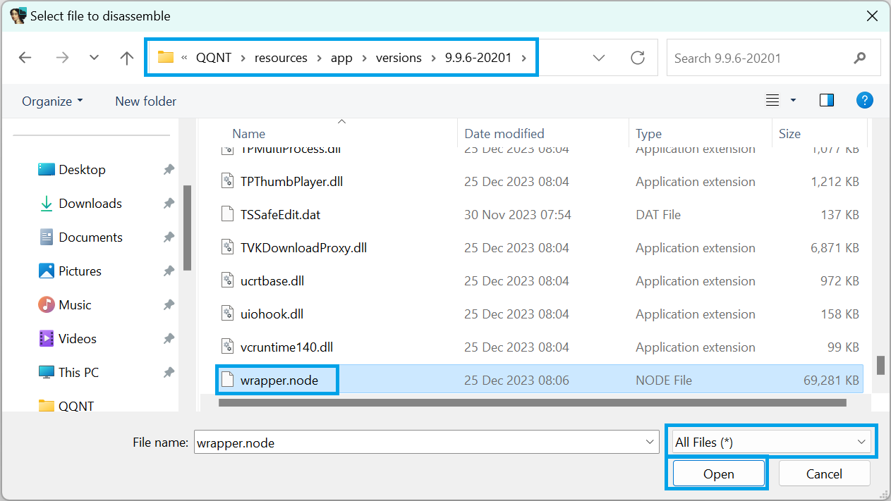

3. 保持默认导入选项，点击 "Ok" 按钮。如果有弹出 symbol 文件相关提示框点击 "No"。等待文件加载完成。

4. 按快捷键 <kbd>Shift</kbd> + <kbd>F12</kbd> 打开 Strings 标签，等待页面加载完成。切换到 Strings 标签使用鼠标单击内部区域，按快捷键 <kbd>Ctrl</kbd> + <kbd>F</kbd> 打开搜索框，输入 `nt_sqlite3_key_v2`。

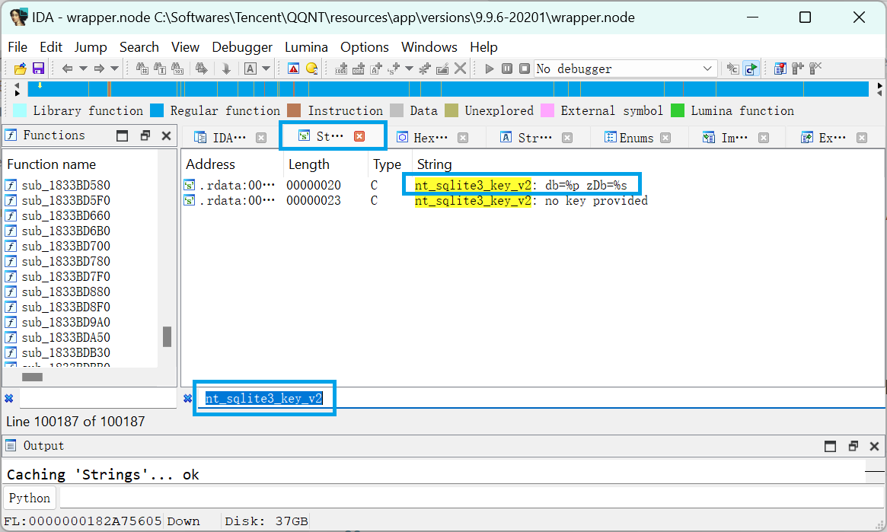

5. 双击 `nt_sqlite3_key_v2: db=%p zDb=%s` 一行，跳转到 IDA View-A 标签的对应行。

6. 点击顶部导航栏 "Options" 中的 "General..." 菜单项，打开 IDA Options 窗口。在 Disassembly 标签页中，将 Display assembly lines 中的 Source line numbers 勾选上，点击 "Ok" 按钮。

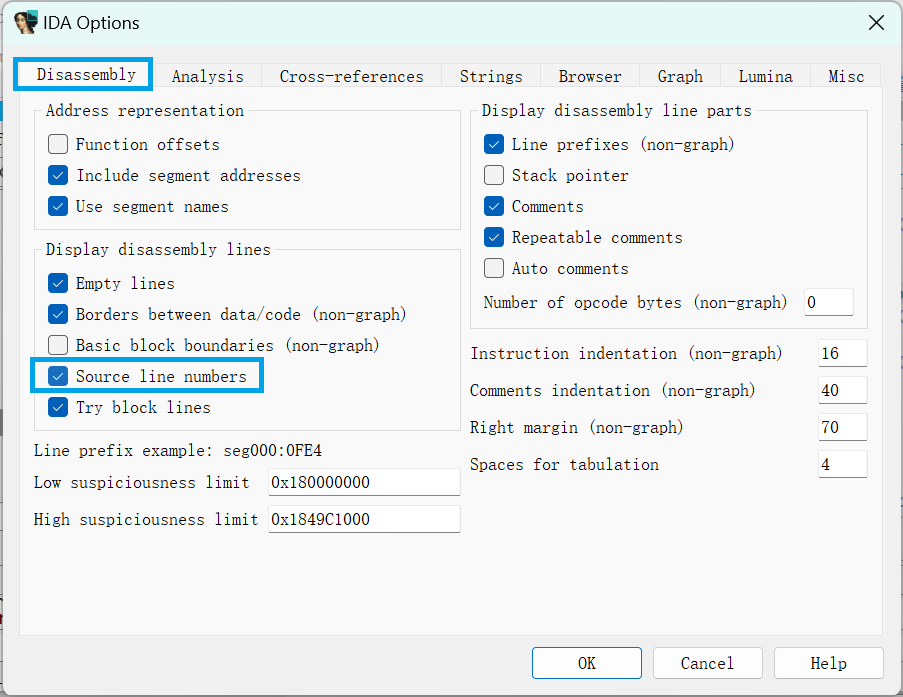

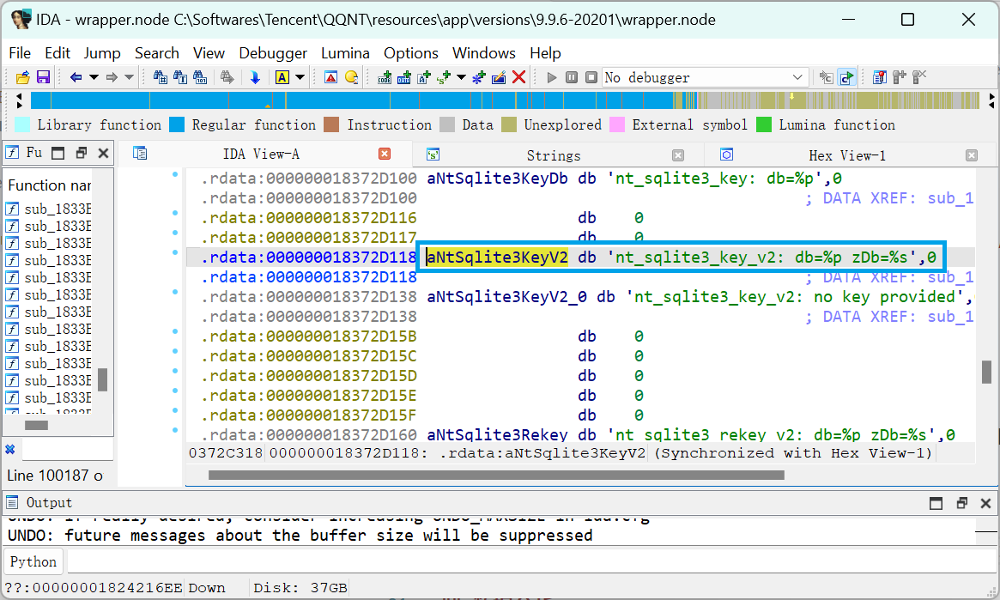

7. 在 IDA View-A 标签中，单击 `nt_sqlite3_key_v2` 的名称 `aNtSqlite3KeyV2`，按快捷键 <kbd>X</kbd> 打开交叉引用窗口。

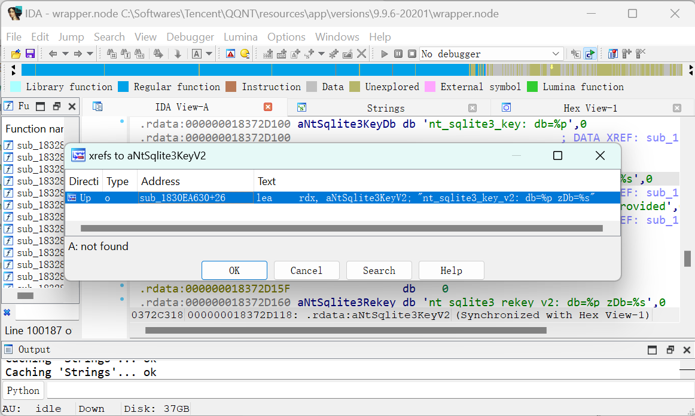

8. 双击第一条结果，转到引用位置。

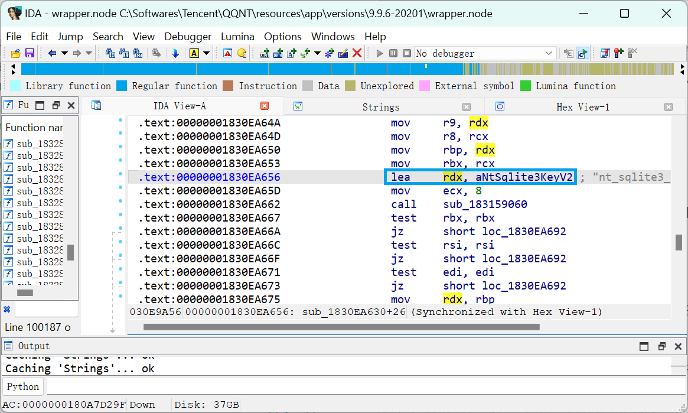

9. 按快捷键 <kbd>F5</kbd> 进行反编译，如果有弹出窗口点击 "Yes"。等待反编译完成。

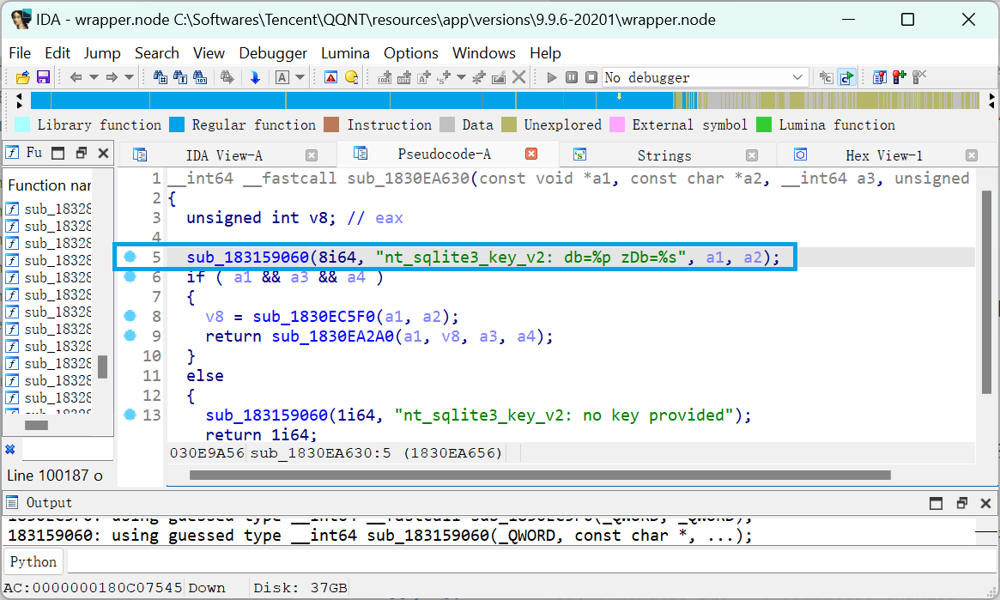

10. 单击引用语句的左侧蓝色圆点添加断点。

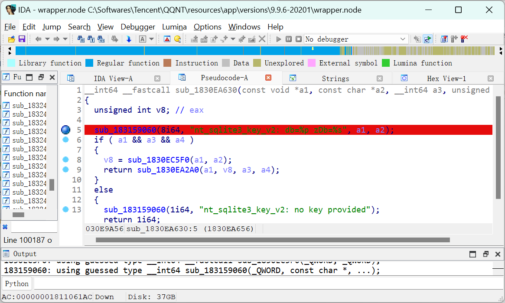

11. 修改 Debugger 下拉框的值为 "Local Windows Debugger"。

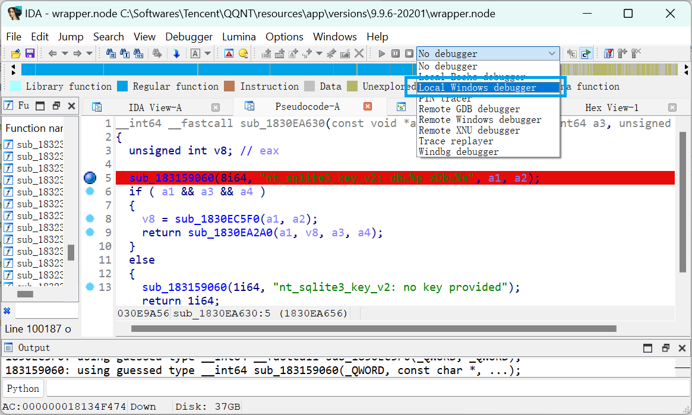

12. 如果有正在运行的 QQNT 客户端，先全部退出。打开一个新的 QQNT 客户端，进入登录界面并暂停操作。

13. 在 IDA 中点击顶部导航栏 "Debugger" 中的 "Attach to process..." 菜单项，打开 "Attach to process" 窗口。从最后开始找到第一个 "QQ.exe" 进程，双击打开。

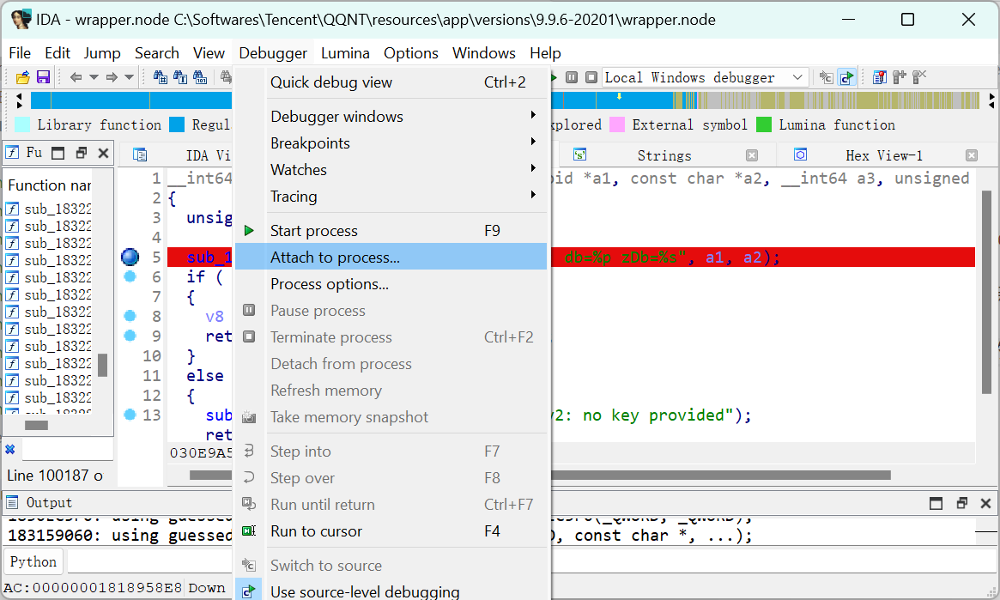

14. 等待加载完成后按快捷键 <kbd>F9</kbd> 继续运行。

15. 进行登录操作，触发断点。

16. 在 IDA 中点击顶部导航栏 "Debugger" 中的 "Debugger windows" 菜单项，打开 Locals 选项卡。

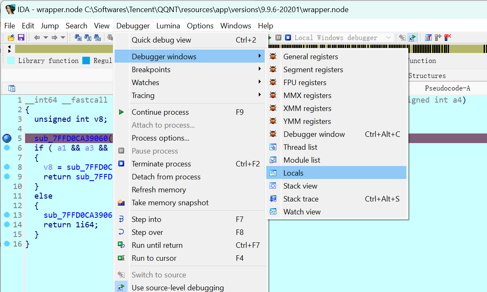

17. 右击 Locals 选项卡的 `a3`，点击 "Jump to..." 菜单项。

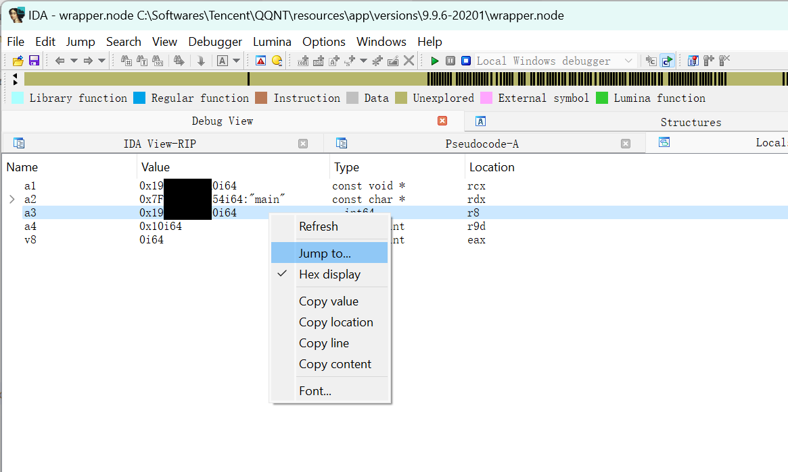

18. 记录对应地址从 `0` 到 `F` 的 16 个字节对应的字符串，即为数据库密码。

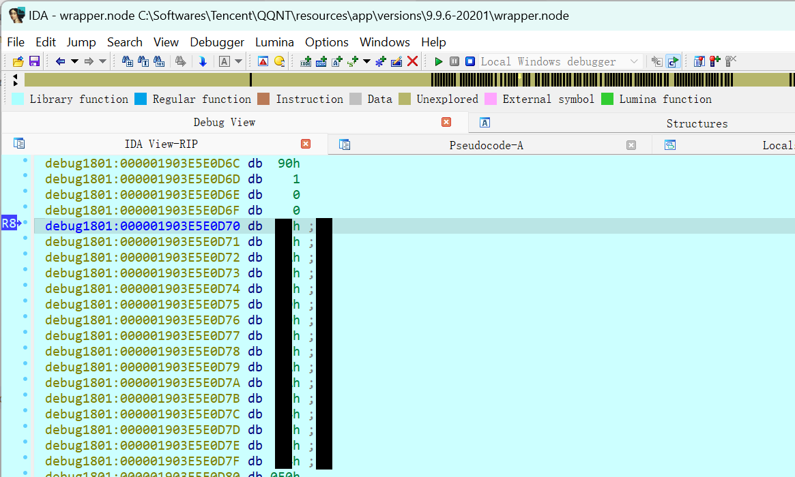

### 数据导出

TODO

## 数据分析

TODO
